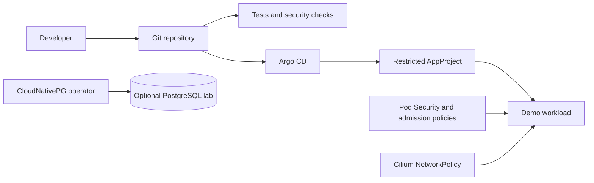

# kubefoundry

[](https://github.com/vynazevedo/kubefoundry/actions/workflows/ci.yml)
[](LICENSE)

A reproducible Kubernetes platform engineering lab. Build a restricted workload, deploy it with Helm and Argo CD, and prove that admission and network controls reject unsafe behavior. Runs locally on kind with a dedicated kubeconfig.



## Features

- Two-node local cluster with Cilium and no public service exposure
- Non-root, read-only workload, dropped capabilities, seccomp and no mounted service account token
- Native validating admission policies with fail-closed enforcement in labeled workload namespaces
- Resource quotas, container defaults and a read-only developer role without access to secrets
- Helm chart with schema validation, probes, resource budgets and a disruption budget
- Argo CD with a namespace-scoped AppProject, automated reconciliation and shared-resource protection
- Positive and negative tests for admission and network isolation
- Optional PostgreSQL operator lab and an ApplicationSet example for fleet-oriented studies
- Pinned tool and chart versions, checksum-verified tool downloads, CI actions pinned by commit

## Quickstart

Requires Linux, macOS or WSL2, Docker, kubectl, Go with toolchain downloads enabled, Python 3, curl, tar and make. Plan for roughly 4 CPUs and 8 GiB available to Docker for the base lab; add capacity for Argo CD and PostgreSQL. These are starting estimates, not measured minimums.

```bash
git clone https://github.com/vynazevedo/kubefoundry.git
cd kubefoundry
make tools
make check
make up
make image deploy
make security
make verify
```

The tools are installed under `.bin/`. The cluster is named `kubefoundry`; its kubeconfig is `.state/kubeconfig`. Scripts use that explicit context and do not deploy into your default cluster. `make up` refuses to adopt an existing cluster with the same name.

Access the demo through a loopback-only port forward.

```bash
export KUBECONFIG="$PWD/.state/kubeconfig"
kubectl --context kind-kubefoundry -n playground port-forward service/demo 8080:8080 --address 127.0.0.1
```

Open `http://127.0.0.1:8080`. Port forwarding is an administrative access path and is not evidence that NetworkPolicy permits pod-to-pod access. `make verify` tests that separately.

## GitOps

```bash
make gitops
```

This installs Argo CD and points its demo Application at this repository. The local image must already have been built and loaded with `make image`. Argo CD renders the same Helm chart used by `make deploy`; after enabling GitOps, change desired state in Git rather than running manual deployment commands. Fork users must update `repoURL` and the AppProject source allowlist.

The UI remains a ClusterIP service. To inspect it locally, forward port 443 to localhost. Argo CD initially uses its generated certificate and bootstrap admin credential; configure OIDC, remove the bootstrap admin and review RBAC before any shared deployment. This lab does not expose the UI publicly or preconfigure an identity provider.

`gitops/applicationsets/demo.yaml` is an alternative exercise, not installed by the quickstart. It shows list-driven Application generation. To switch, delete the original Application **without cascading workload deletion** before installing the ApplicationSet. Do not use both to manage the same objects. Additional destinations require explicit AppProject changes.

## Operator lab

```bash
make database
```

Installs CloudNativePG and a single-instance study database using local storage. The operator generates application credentials as Kubernetes Secrets; they are not committed to Git. The database namespace limits inbound access to the operator and same-namespace workloads. It is not connected to the demo application.

This exercise covers an existing operator and its custom resource. It is not highly available and has no configured external backup. Deleting the kind cluster destroys its storage. Backup recovery, a custom operator and production storage are later milestones, not delivered guarantees.

## Learning path

| Exercise | Action | Evidence |
| --- | --- | --- |
| Workload lifecycle | Build and deploy the demo | Probes and rollout become ready |
| Helm | Change replicas or resource values | Rendered manifests and schema validation |
| Admission | Run the negative fixtures | Privileged pods, writable roots and token mounts are rejected |
| Network isolation | Run labeled and unlabeled clients | Only the authorized client reaches the same service IP |
| Least privilege | Check the observer account | Logs are readable; secrets and writes are denied |
| GitOps | Change a tracked value through a PR | Argo CD reconciles the workload |
| Operators | Install the database profile | CloudNativePG reconciles a ready Cluster resource |

## Versions

The executable version inventory is [versions.env](versions.env). Kubernetes 1.36.4 is selected from the kind release images because Cilium 1.20.2 lists Kubernetes 1.36 in its tested compatibility matrix. Using a newer Kubernetes minor before the networking stack validates it is not the update policy for this lab.

| Component | Pin |
| --- | --- |
| kind | 0.33.0 |
| Kubernetes | 1.36.4, node image pinned by SHA-256 |
| Helm | 4.3.0 |
| Cilium | 1.20.2 |
| Argo CD Helm chart | 10.10.0 |
| CloudNativePG Helm chart | 0.29.1 |
| Go | 1.27.1 |

## Security boundaries

The demo image is a locally built static Go binary in `scratch`. The chart supports digest references, but the local workflow loads a version-tagged image into kind. `make security` runs govulncheck and Trivy, rejects HIGH/CRITICAL image vulnerabilities and detected secrets, and writes a CycloneDX SBOM to `.state/demo.cdx.json`. Image signature verification and SBOM admission enforcement are not implemented yet.

The AppProject restricts application destinations and resource kinds. Argo CD itself and infrastructure operators retain powerful cluster permissions. Repository writers, cluster administrators and the local Docker owner are trusted. Namespace isolation is not a boundary against a malicious cluster administrator.

Native admission policies complement Pod Security and avoid adding another controller for the initial rules. They apply only to namespaces carrying the workload label. Infrastructure namespaces require separate controls. No credentials, kubeconfigs or generated knowledge files belong in Git.

## Platform engineering direction

The design takes inspiration from the public discussion of [Kubernetes in Mercado Libre's Fury platform](https://medium.com/mercadolibre-tech/kubernetes-at-mercado-libre-ec331bea1866), particularly standardized developer workflows and the separation of application and platform responsibilities. This project is independent and does not reproduce or claim Mercado Libre's internal architecture or scale.

Next milestones are multi-team onboarding with automated isolation tests, Gateway API with TLS, OpenTelemetry pipelines and SLOs, verified image promotion, external secret integration, progressive delivery and database recovery drills. Each needs runnable scenarios and acceptance tests before being listed as a delivered feature.

## Cleanup

```bash
make down
```

Deletes only the kind cluster named `kubefoundry`, including database data. Local source files remain.

## License

[MIT](LICENSE)
