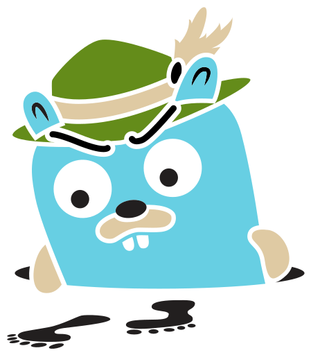
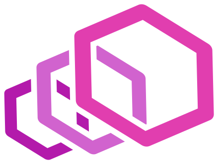
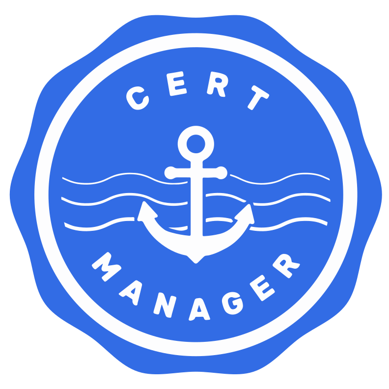
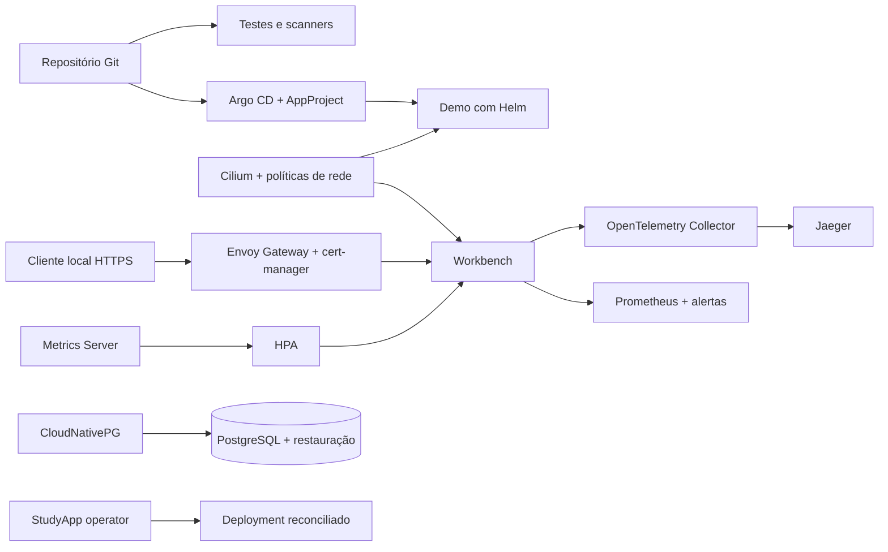

<h1 align="center">KubeFoundry</h1>
<p align="center"><strong>Construa. Provoque uma falha. Comprove a recuperação.</strong></p>
<p align="center">Aprenda Kubernetes e engenharia de plataforma com laboratórios reproduzíveis, segurança e testes executáveis.</p>

<p align="center">
  <a href="docs/getting-started/do-zero.md">Comece do zero</a> ·
  <a href="docs/README.md">Documentação</a> ·
  <a href="docs/tutorials/plataforma-completa.md">Trilhas avançadas</a> ·
  <a href="docs/assets/README.md">Evidências reais</a>
</p>

[](https://github.com/vynazevedo/kubefoundry/actions/workflows/ci.yml)
[](LICENSE)

Do primeiro Pod à investigação de uma falha usando métricas, logs e traces. O KubeFoundry conecta fundamentos, Helm, GitOps, isolamento de times, operators e operação em um cluster local descartável. Cada laboratório explica o conceito, mostra como executar e define uma evidência para saber se funcionou.

<table>
  <tr>
    <td align="center"><a href="https://kubernetes.io/"></a><br><strong>Kubernetes</strong><br>Orquestração</td>
    <td align="center"><a href="https://helm.sh/"></a><br><strong>Helm</strong><br>Pacotes</td>
    <td align="center"><a href="https://argo-cd.readthedocs.io/"></a><br><strong>Argo CD</strong><br>GitOps</td>
    <td align="center"><a href="https://cilium.io/"></a><br><strong>Cilium</strong><br>Rede</td>
    <td align="center"><a href="https://cloudnative-pg.io/"></a><br><strong>CloudNativePG</strong><br>Operator PostgreSQL</td>
  </tr>
  <tr>
    <td align="center"><a href="https://opentelemetry.io/"></a><br><strong>OpenTelemetry</strong><br>Instrumentação</td>
    <td align="center"><a href="https://prometheus.io/"></a><br><strong>Prometheus</strong><br>Métricas e alertas</td>
    <td align="center"><a href="https://www.jaegertracing.io/"></a><br><strong>Jaeger</strong><br>Traces</td>
    <td align="center"><a href="https://gateway.envoyproxy.io/"></a><br><strong>Envoy Gateway</strong><br>Gateway API</td>
    <td align="center"><a href="https://cert-manager.io/"></a><br><strong>cert-manager</strong><br>Certificados</td>
  </tr>
</table>

Também usamos **Go**, **kind**, **Metrics Server**, **External Secrets**, **Cosign**, **Trivy**, **govulncheck** e **GitHub Actions**. Os logotipos oficiais identificam as tecnologias utilizadas e não indicam endosso. Consulte a [origem dos arquivos](assets/technologies/sources.json).

## Escolha seu ponto de partida

| Seu momento | Por onde começar | O que você vai praticar |
| --- | --- | --- |
| Nunca usei Kubernetes | [Trilha do zero](docs/getting-started/do-zero.md) | Pod, Deployment, Service, probes e diagnóstico |
| Já conheço os recursos | [Índice de estudos](docs/README.md) | Helm, GitOps, rede, RBAC e admissão |
| Quero operar uma plataforma | [Trilhas avançadas](docs/tutorials/plataforma-completa.md) | Observabilidade, escala, TLS, canary, recuperação e controllers |
| Quero avaliar as decisões | [Arquitetura e evolução](docs/architecture/trilhas-e-evolucao.md) | Cobertura, referências públicas e limites de cada perfil |

A documentação está em português, com exemplos para iniciantes e detalhes técnicos para quem quer aprofundar. Leia o resultado esperado antes de executar e use os testes para investigar por que uma mudança funcionou ou falhou.

## Arquitetura



Os perfis são exercícios complementares. O banco não é dependência da aplicação demo; o operator próprio gerencia uma aplicação separada; o canary usa revisões de configuração do Workbench. Isso permite estudar cada comportamento sem esconder suas dependências.

## Execute o laboratório básico

Requer Linux, macOS ou WSL2, Docker, kubectl, Go com download de toolchains habilitado, Python 3, curl, tar e make. Reserve inicialmente 4 CPUs e 8 GiB disponíveis ao Docker para o perfil básico. Para todos os perfis, planeje 6 CPUs e 12 GiB. São estimativas de planejamento, não mínimos medidos.

```bash
git clone https://github.com/vynazevedo/kubefoundry.git
cd kubefoundry
make tools
make check docs-check
make up
make image deploy
make fundamentals-test
make security verify
```

As ferramentas ficam em `.bin/`. O cluster se chama `kubefoundry`, com kubeconfig dedicado em `.state/kubeconfig`. Os scripts usam explicitamente o contexto `kind-kubefoundry`. `make up` recusa adotar um cluster existente com esse nome.

Para acessar a aplicação

```bash
export KUBECONFIG="$PWD/.state/kubeconfig"
kubectl --context kind-kubefoundry -n playground port-forward service/demo 8080:8080 --address 127.0.0.1
```

Abra `http://127.0.0.1:8080`. Port-forward é um acesso administrativo e não comprova a permissão entre Pods. `make verify` testa o tráfego entre clientes autorizados e não autorizados contra o mesmo endereço de serviço.

## Helm, GitOps e banco

```bash
make gitops
make database
```

O Argo CD reconcilia o chart da demo usando um AppProject restrito. A imagem local precisa ter sido carregada por `make image`. Depois de habilitar GitOps, altere o estado desejado no Git. Em um fork, ajuste `repoURL` e a lista de fontes do AppProject. A [trilha GitOps](docs/README.md) explica a operação e o exemplo alternativo de ApplicationSet, que não deve gerenciar os mesmos objetos junto com a Application original.

CloudNativePG instala um banco de estudo com armazenamento local. As credenciais são geradas como Secrets, sem versionamento. O [laboratório de recuperação](docs/tutorials/recuperacao.md) cria outros dois bancos temporários para testar backup lógico e restauração sem alterar os dados do banco de estudo.

## Execute os perfis avançados

Com o cluster pronto

```bash
make advanced-test
```

Esse comando constrói as aplicações e executa todos os cenários abaixo, sequencialmente. Não use `make -j`, pois alguns perfis alteram a mesma aplicação. Também é possível executar [cada etapa separadamente](docs/tutorials/plataforma-completa.md).

| Cenário | O teste exige | Tutorial |
| --- | --- | --- |
| ConfigMap e Secret | Arquivo atualiza, ambiente muda após reinício e segredo não aparece na saída | [Configuração](docs/tutorials/configuracao-storage.md) |
| StatefulSet e PVC | Conteúdo sobrevive à substituição do Pod | [Armazenamento](docs/tutorials/configuracao-storage.md) |
| Isolamento entre times | Tráfego próprio passa; tráfego e permissões cruzadas são negados | [Múltiplos times](docs/security/multiplos-times.md) |
| OpenTelemetry e Prometheus | Uma falha aparece em métrica, alerta, log e trace consultado pelo ID exato | [Observabilidade](docs/tutorials/observabilidade.md) |
| HPA | Réplicas aumentam sob carga e voltam a uma após a carga | [Autoscaling](docs/tutorials/autoscaling.md) |
| Backup e recuperação | Outro banco restaura apenas os registros existentes no backup | [Recuperação](docs/tutorials/recuperacao.md) |
| Gateway API e TLS | HTTPS valida CA e hostname; certificado sem confiança é rejeitado | [Gateway](docs/tutorials/gateway-canary.md) |
| Canary e rollback | Duas revisões recebem tráfego e rollback retorna à estável | [Canary](docs/tutorials/gateway-canary.md) |
| External Secrets | Duas revisões fictícias são sincronizadas sem imprimir os valores | [Secrets](docs/security/secrets-assinaturas.md) |
| Cosign | Artefato original verifica e uma cópia alterada é rejeitada | [Assinaturas](docs/security/secrets-assinaturas.md) |
| Operator próprio | Reconciliação, nova geração, recriação e coleta de dependentes | [StudyApp](docs/tutorials/operator-proprio.md) |

## Veja uma falha de verdade

O endpoint de laboratório `/fail` produz um HTTP 503 controlado. O teste confere o contador, espera o alerta, encontra o ID no log e consulta o mesmo trace no Jaeger.


As capturas são do cluster local. [Contexto e proveniência](docs/assets/README.md). Os dados da observabilidade são efêmeros e não devem ser usados para retenção de produção.

## Segurança verificável

- Workloads sem root, filesystem somente leitura, capabilities removidas, seccomp e recursos limitados.
- Pod Security e políticas nativas de admissão, com testes que rejeitam configurações inseguras nos namespaces protegidos.
- NetworkPolicy, RBAC e quotas, com controles positivos e negativos. Erro de imagem ou Pod não agendado não conta como isolamento comprovado.
- Testes Go com detector de corrida, `go vet`, govulncheck, Trivy e SBOM CycloneDX. Achados HIGH/CRITICAL e segredos detectados nas imagens reprovam a verificação.
- Ferramentas com versões fixadas e checksums, além de ações de CI referenciadas por commit.

Os perfis usam imagens locais carregadas no kind. O exercício Cosign verifica um **artefato binário offline**, sem enforcement de assinaturas na admissão de imagens. External Secrets usa um backend Kubernetes local e valores fictícios. O Metrics Server usa uma exceção de TLS de kubelet necessária para este perfil kind, explicada no tutorial.

Argo CD e os operators de infraestrutura têm permissões administrativas. Administradores do cluster, escritores do repositório e o proprietário do Docker são confiáveis. Isolamento de namespace não protege contra um administrador malicioso. A UI do Argo CD permanece interna; revise OIDC, admin inicial e RBAC antes de qualquer ambiente compartilhado.

## Versões e manutenção

[versions.env](versions.env) registra as versões das ferramentas, charts e componentes. Os módulos Go têm arquivos `go.mod` e `go.sum`. Os manifests fixam as imagens correspondentes e o CI verifica sua consistência com o inventário.

Kubernetes 1.36.4 foi selecionado entre as imagens do kind porque consta na matriz de compatibilidade testada pelo Cilium 1.20.2. Atualizar significa validar o conjunto, não apenas escolher a maior versão isolada. Consulte o [guia de manutenção](docs/operations/manutencao.md).

## Relação com práticas do mercado

Os exercícios trabalham conceitos presentes em plataformas modernas, como reconciliação, padronização, isolamento, observabilidade e recuperação. A [comparação com referências públicas](docs/architecture/trilhas-e-evolucao.md) explica o alinhamento com conteúdos da LinuxTips e práticas divulgadas por Mercado Livre e iFood, sem alegar certificação ou equivalência às plataformas internas dessas empresas.

Este é um ambiente de estudos testável. Alta disponibilidade, disaster recovery de nuvem, SLOs de negócio, promoção automática com análise de métricas e políticas de assinatura no admission controller exigem infraestrutura e decisões adicionais. Cada tutorial delimita o que seu teste comprova.

## Estrutura

```text
apps/demo/          Aplicação básica e testes
apps/workbench/     Aplicação instrumentada para os cenários avançados
operators/studyapp/ Controller próprio com CRD e reconciliação
charts/demo/        Helm, schema e políticas de rede
bootstrap/          Cluster local e configuração do Argo CD
gitops/             AppProject, Application e exemplo de ApplicationSet
platform/           Admissão, quotas, Cilium e PostgreSQL
labs/               Fundamentos e manifests dos perfis avançados
scripts/            Instalação e cenários executáveis
tests/              Validação estática e controles no cluster
docs/               Trilhas em português, diagramas e capturas reais
assets/             Logotipos oficiais com origem registrada
```

## Contribua

Contribuições úteis incluem cenários reproduzíveis, explicações mais claras e novos controles negativos. No pull request, descreva os comandos executados, o resultado esperado e o observado. Mantenha os exemplos executáveis no perfil local e informe requisitos adicionais.

Use [issues](https://github.com/vynazevedo/kubefoundry/issues) ou [discussions](https://github.com/vynazevedo/kubefoundry/discussions) para dúvidas e melhorias. Vulnerabilidades sensíveis podem ser enviadas pelo [canal privado do GitHub](https://github.com/vynazevedo/kubefoundry/security/advisories/new).

## Limpeza

```bash
make down
```

Remove o cluster `kubefoundry` e seus dados, incluindo os bancos. Dumps sintéticos e relatórios locais permanecem em `.state/`, ignorada pelo Git. Os fontes permanecem no diretório do projeto.

## Licença

[MIT](LICENSE). Os logotipos seguem as condições de seus respectivos titulares.
