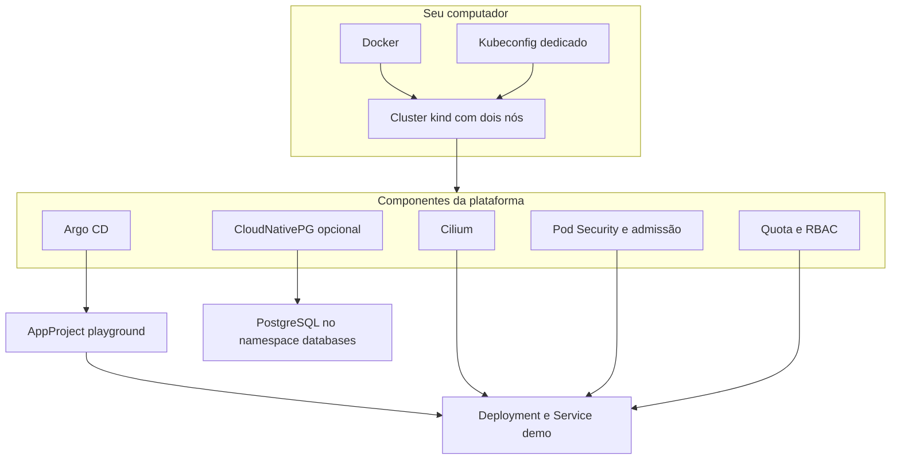

# Arquitetura e responsabilidades

## Para começar

O laboratório separa a infraestrutura que sustenta aplicações da configuração da aplicação. Os scripts de bootstrap são executados com privilégios administrativos. O Argo CD gerencia a aplicação dentro dos limites do AppProject.

## Onde cada responsabilidade mora

| Diretório | Responsabilidade |
| --- | --- |
| `bootstrap/` | Topologia kind e valores iniciais do Argo CD |
| `platform/` | Rede, políticas, orçamento do namespace e perfil de banco |
| `apps/demo/` | Serviço Go e testes unitários |
| `charts/demo/` | Manifests da aplicação renderizados pelo Helm |
| `gitops/` | Origens, destinos e objetos gerenciados pelo Argo CD |
| `scripts/` | Sequência reproduzível de instalação e validação |
| `tests/` | Verificação estática e comportamento no cluster |

## Para aprofundar

A rede padrão do kind é desabilitada para que Cilium assuma essa função. O kube-proxy permanece habilitado. O laboratório não ativa Gateway API nem exposição pública.

A NetworkPolicy do chart seleciona os Pods da release. Ela permite entrada na porta 8080 de clientes com a label autorizada no mesmo namespace e não permite novas conexões de saída desses Pods. A seleção não cobre automaticamente todo Pod futuro do namespace. Quem pode criar ou alterar labels de Pods é parte do modelo de confiança.

O AppProject permite um repositório, um namespace de destino e uma lista de tipos de recursos. Isso limita as Applications daquele projeto, mas não remove os privilégios administrativos dos controllers instalados pelo bootstrap.

O PostgreSQL é independente da aplicação demo. Ele usa armazenamento local e uma instância. Não há réplica em outra zona nem backup externo. Uma reprodução de escala empresarial exigiria testes de capacidade, limites entre times, SLOs, recuperação e decisões de infraestrutura que não podem ser comprovadas num único computador.

Consulte os valores realmente executados em [versions.env](../../versions.env). Kubernetes 1.36.4 foi escolhido para permanecer na matriz testada do Cilium 1.20.2 consultada na implementação; a combinação deve ser reavaliada a cada atualização.

[Voltar ao índice](../README.md)
