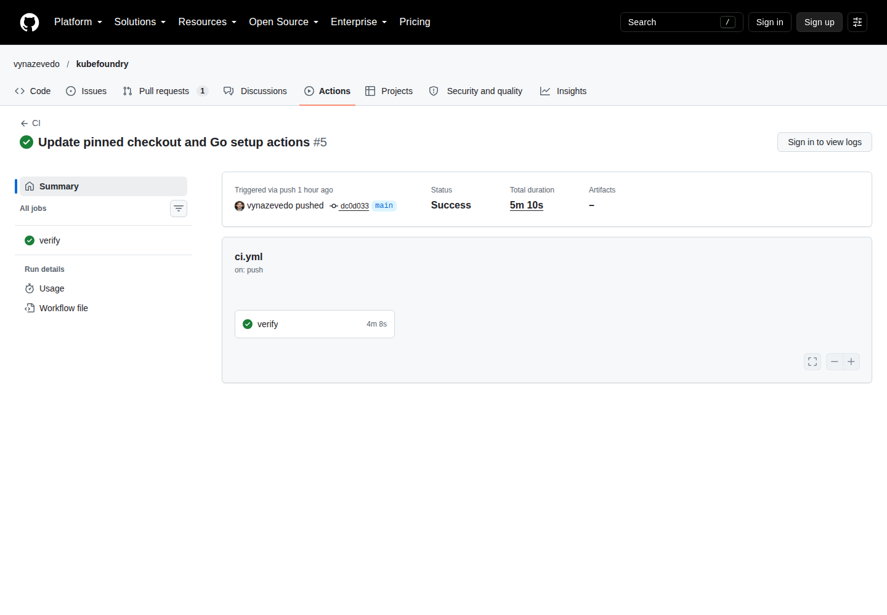

# Evidências, capturas e diagramas

## Execução real do CI

A captura abaixo mostra uma execução pública do GitHub Actions. Ela documenta o estado daquela execução; não substitui consultar o CI atual.

- [Execução original](https://github.com/vynazevedo/kubefoundry/actions/runs/37784398679)
- Commit validado `dc0d0330f38997e0a737d73f6d0ded266b46c403`
- Captura realizada em 8 de outubro de 2026, sem edição da interface.
- A execução incluiu Go, Helm, cluster kind, scanner e SBOM, admissão, rede, RBAC, Argo CD e CloudNativePG.

## Interfaces reais dos perfis avançados

- [Jaeger local](screenshots/jaeger-local.png), consultando o serviço instrumentado.
- [Prometheus local](screenshots/prometheus-alerts.png), exibindo regras de alerta.

As capturas foram feitas no cluster local em 8 de outubro de 2026. Consulte a [proveniência](screenshots/provenance.json) para método e checksums.

## Como contribuir com novas capturas

Prefira uma imagem que explique uma tarefa concreta, acompanhada dos comandos, do resultado esperado e de texto alternativo. Registre a versão e o cenário. Revise a imagem para garantir que não mostra senhas, tokens ou dados privados.

Capturas do Argo CD e do banco serão adicionadas quando houver uma sessão acessível dessas interfaces. Não usamos telas simuladas como prova de execução. Diagramas Mermaid, presentes nas páginas de conceitos e arquitetura, são explicações do fluxo e não screenshots.

[Voltar ao índice](../README.md)
