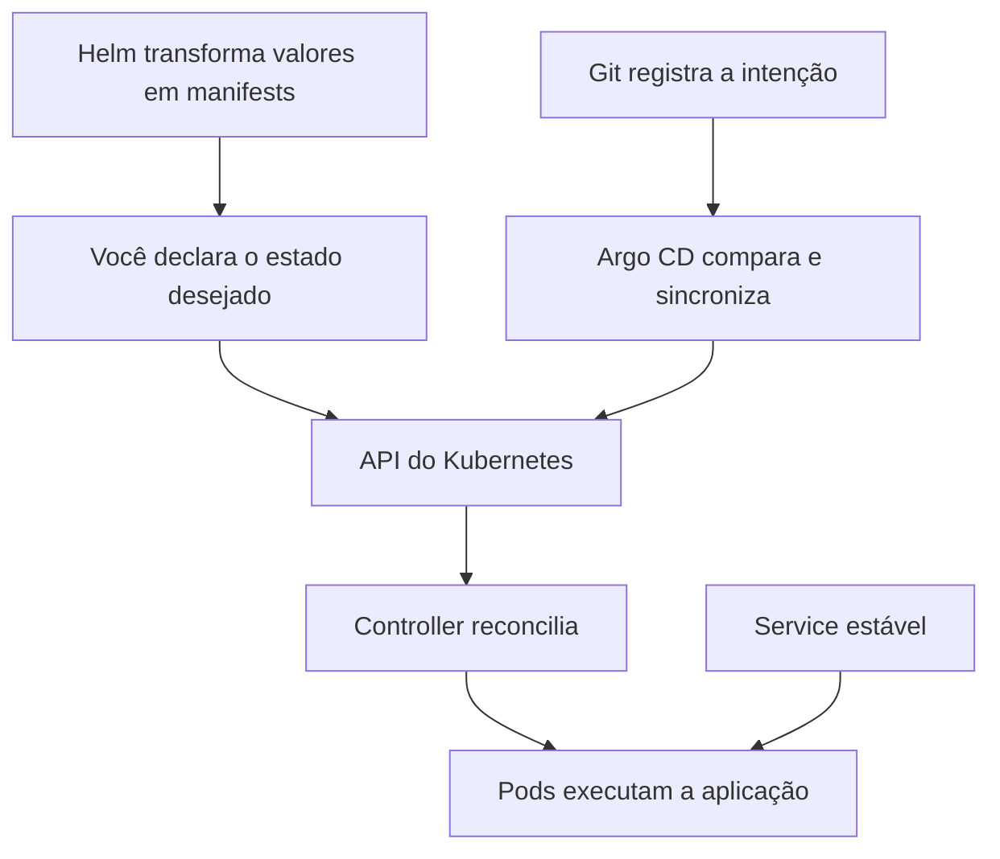

# Conceitos essenciais

## Para começar

Uma imagem de container é um pacote com a aplicação e os arquivos necessários para executá-la. Um container é uma execução desse pacote. Kubernetes coordena essas execuções em máquinas chamadas **nós**.

Um **cluster** reúne os nós e os componentes de controle. No KubeFoundry, o kind cria esses nós dentro do Docker. Isso facilita estudar sem contratar infraestrutura em nuvem.

| Termo | O que significa aqui |
| --- | --- |
| Pod | Unidade de execução; nossa aplicação usa um container por Pod |
| Deployment | Declara quantas réplicas executar e coordena substituições |
| Service | Oferece um endereço estável para encontrar os Pods |
| Namespace | Agrupa recursos e ajuda a organizar permissões e políticas |
| Label | Identificador usado por seletores para escolher recursos |
| Manifest | Arquivo YAML que descreve o estado desejado |
| Controller | Observa o estado atual e tenta aproximá-lo do desejado |
| Reconciliation | Repetição desse processo de comparação e ajuste |
| CRD | Amplia a API do Kubernetes com um novo tipo de recurso |
| Operator | Controller que automatiza conhecimento operacional de um domínio |

Se um Deployment pede duas réplicas e uma desaparece, o controller tenta criar outra. Ele não sabe, sozinho, se um pedido comercial foi processado corretamente. Disponibilidade de Pods e correção da aplicação são coisas diferentes que precisamos medir.

## Como as ferramentas se conectam

Helm organiza templates e valores. Argo CD observa o Git e aplica o estado declarado. Cilium implementa a rede e as políticas de tráfego. CloudNativePG entende o ciclo de vida de PostgreSQL por meio de um recurso `Cluster`.

## Para aprofundar

Namespace não cria isolamento de rede automaticamente. Uma NetworkPolicy precisa selecionar os Pods e ser aplicada por uma implementação de rede compatível. RBAC controla chamadas à API; não substitui NetworkPolicy. Pod Security controla características do Pod; não examina a lógica da aplicação.

A reconciliação é contínua e pode levar algum tempo. Uma API aceitar um manifest não prova que a aplicação ficou pronta. Por isso verificamos rollout, condições de saúde e comportamento dos clientes.

Referências oficiais. [conceitos do Kubernetes](https://kubernetes.io/docs/concepts/) e [padrão Operator](https://kubernetes.io/docs/concepts/extend-kubernetes/operator/).

[Voltar ao índice](../README.md)
