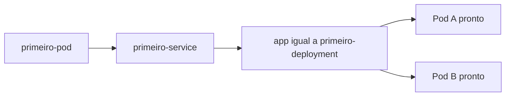

# Service, seletores e diagnóstico

## Objetivo

Mostrar por que um Service pode existir e mesmo assim não encaminhar tráfego. Requer os Pods do [exercício anterior](fundamentos-pods.md).

```bash
export KUBECONFIG="$PWD/.state/kubeconfig"
kubectl --context kind-kubefoundry apply -f labs/fundamentos/service.yaml
kubectl --context kind-kubefoundry -n fundamentos get service primeiro-service
kubectl --context kind-kubefoundry -n fundamentos get endpointslices -l kubernetes.io/service-name=primeiro-service -o yaml
kubectl --context kind-kubefoundry -n fundamentos exec primeiro-pod -- /demo probe http://primeiro-service:8080/healthz
```

O programa `probe` já faz parte da nossa imagem. Não precisamos instalar curl dentro do container. Um comando sem mensagem e com código de saída zero significa que recebeu HTTP 200.

EndpointSlices registram os destinos do Service. Observe as condições `ready` e compare os endereços com os IPs dos Pods. O DNS curto funciona porque cliente e Service estão no mesmo namespace.



## Provoque uma falha de seleção

O comando seguinte altera somente o Service do exercício

```bash
kubectl --context kind-kubefoundry -n fundamentos patch service primeiro-service --type=merge -p '{"spec":{"selector":{"app":"nao-existe"}}}'
kubectl --context kind-kubefoundry -n fundamentos get pods --show-labels
kubectl --context kind-kubefoundry -n fundamentos get endpointslices -l kubernetes.io/service-name=primeiro-service -o yaml
```

Aguarde a reconciliação. A API pode mostrar a lista vazia antes de a rede terminar de atualizar suas regras. Uma requisição ainda pode passar nesse intervalo; observe a convergência com prazo limitado, em vez de presumir uma mudança instantânea. O Service continuará existindo, mas não terá destinos prontos correspondentes ao seletor. Repetir o probe deve retornar erro. A forma do erro depende de como a rede trata um Service sem destinos; não exija uma mensagem única.

**Desafio**. Corrija a falha sem recriar Pods e explique qual comparação revelou a causa.

<details>
<summary>Recuperação</summary>

```bash
kubectl --context kind-kubefoundry apply -f labs/fundamentos/service.yaml
kubectl --context kind-kubefoundry -n fundamentos exec primeiro-pod -- /demo probe http://primeiro-service:8080/healthz
```

O manifest restaura o seletor. Espere os endpoints prontos reaparecerem antes de repetir a requisição. O problema era a relação entre labels e seletor, não o processo da aplicação.

</details>

## Para aprofundar

Nos testes automatizados, o probe usa o IP do Service para verificar HTTP sem confundir falhas de DNS com falhas de seleção. O exercício manual acrescenta a resolução por nome. Service ClusterIP não expõe a aplicação à internet.

Próxima etapa. [Readiness e recuperação](fundamentos-readiness.md). Referência. [Services](https://kubernetes.io/docs/concepts/services-networking/service/).

[Voltar ao índice](../README.md)
