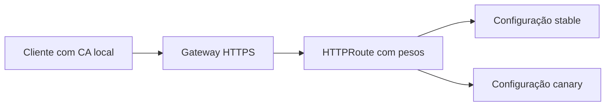

# HTTPS, Gateway API e canary

## Preparação

Requer `make advanced-up`.

```bash
make gateway-test
make canary-test
```

O primeiro comando instala Envoy Gateway e cert-manager. Cria um certificado para `localhost`, um Gateway HTTPS e uma HTTPRoute para a aplicação. O Service do proxy é ClusterIP; não há LoadBalancer público.

O teste confia explicitamente no certificado local, verifica hostname e recebe HTTP 200. Uma conexão sem essa confiança deve falhar. Não usamos `curl -k` como evidência de TLS correto.

## Entrega gradual

O exercício usa duas revisões de configuração da mesma aplicação. A estável responde `stable` e a candidata responde `canary`. Não são duas versões de código diferentes.

O teste começa com 100% de peso na estável, muda para pesos 50/50 e confirma respostas das duas revisões em requisições reais. Depois volta a 100% na estável e valida o retorno. Amostras pequenas não precisam ter divisão exata de 50/50.



## Inspecione

```bash
export KUBECONFIG="$PWD/.state/kubeconfig"
kubectl --context kind-kubefoundry -n kf-platform get certificates,gateways,httproutes
kubectl --context kind-kubefoundry -n kf-platform describe httproute workbench
```

**Desafio**. O que você observaria antes de promover uma versão de negócio? Considere taxa de erros, latência, compatibilidade de dados e possibilidade de rollback.

## Limites

A CA é local e o certificado é autoassinado. Não há ACME, DNS público ou renovação testada. O experimento aplica pesos explicitamente e não instala Argo Rollouts nem faz promoção automática por análise. Ele ensina os mecanismos de encaminhamento e rollback que uma automação mais abrangente precisaria coordenar.


[Voltar ao índice](../README.md)
