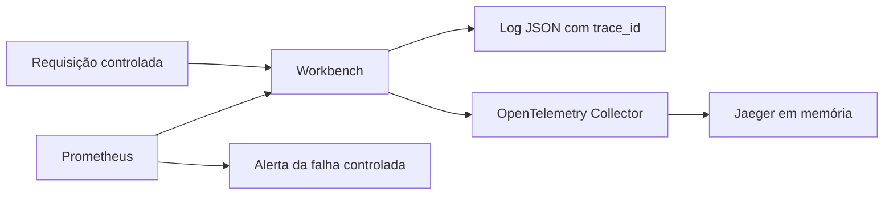
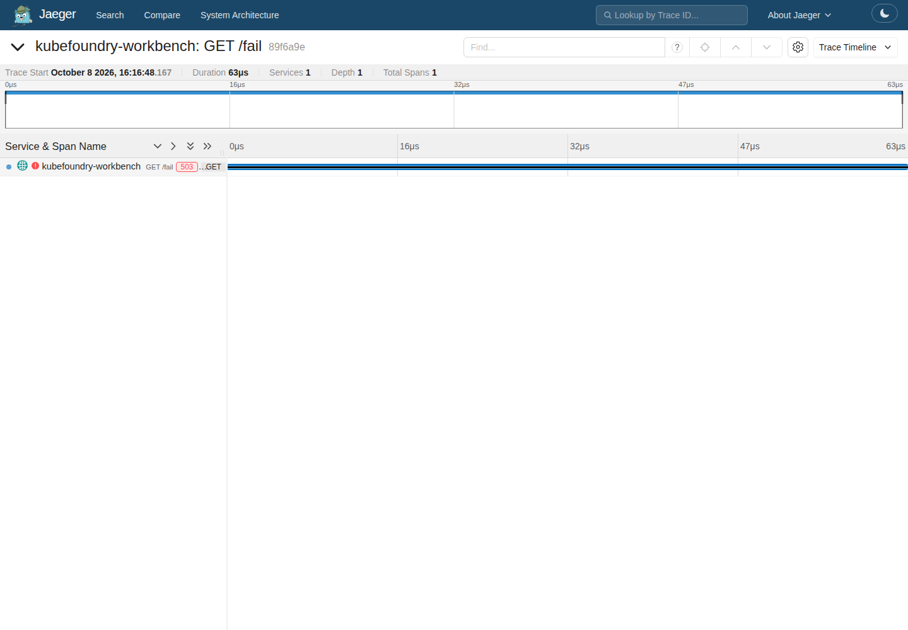
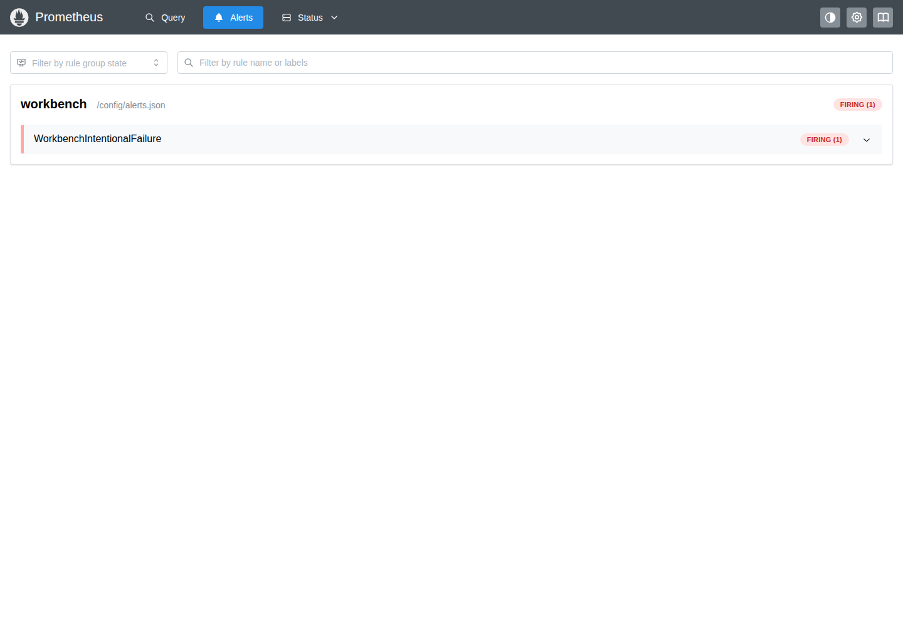

# Uma falha, quatro formas de investigar

## Objetivo

Relacionar métricas, alerta, log e trace da mesma aplicação. Requer `make advanced-up`.

```bash
make observability-up
make observability-test
```

A aplicação instrumentada envia spans OTLP/HTTP ao OpenTelemetry Collector. O Collector aplica limite de memória e batching e exporta ao Jaeger. O Prometheus coleta contadores HTTP diretamente da aplicação e avalia uma regra de alerta.



O teste chama `/fail`, confirma HTTP 503, encontra o incremento da métrica e o alerta ativo. Depois extrai o trace ID do log e consulta esse trace no Jaeger. Não basta encontrar qualquer trace antigo.

## Explore as interfaces

```bash
export KUBECONFIG="$PWD/.state/kubeconfig"
kubectl --context kind-kubefoundry -n kf-observability port-forward service/jaeger 16686:16686 --address 127.0.0.1
```

Abra `http://127.0.0.1:16686` e selecione o serviço `kubefoundry-workbench`. Em outro terminal, com o mesmo kubeconfig, encaminhe o Prometheus

```bash
kubectl --context kind-kubefoundry -n kf-observability port-forward service/prometheus 9090:9090 --address 127.0.0.1
```

Abra `http://127.0.0.1:9090/alerts`. A regra de laboratório observa falhas recentes; seu estado pode voltar a inativo depois da janela de dois minutos.





## Desafio

Compare o timestamp do log com o span. Quais informações uma métrica agregada não consegue explicar? Por que um trace ID ajuda a investigar uma requisição específica?

## SLI, SLO e limites

Um SLI mede comportamento, por exemplo a proporção de operações de negócio concluídas sem erro. Um SLO define um objetivo para esse indicador em uma janela. Nossa regra de falha controlada é um exercício de alerta, não um SLO de produção. O contador de requisições inclui probes e scrapes; não deve ser usado sem filtragem como denominador de disponibilidade de negócio.

Jaeger usa memória e Prometheus usa armazenamento efêmero com retenção curta. Não há backend central de logs nem redundância. O teste consulta logs pelo Kubernetes. OTLP dentro do cluster usa HTTP protegido pelas NetworkPolicies do laboratório, sem mTLS. Essa escolha precisa ser revista para um ambiente compartilhado ou fora desta fronteira.


[Voltar ao índice](../README.md)
